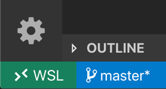

# Angular Sample with WSL

## Prerequisites

For this demo, you will need to install a few tools in your WSL distribution.

```bash
# Make sure your apt utilities are up to date
sudo apt update

# Download the latest 10.x LTS version of NodeJS
curl -sL https://deb.nodesource.com/setup_10.x | sudo -E bash -

# Install NodeJS
sudo apt-get install -y nodejs

# Install NPM (if necessary)
sudo apt install npm

# Install the Angular CLI
sudo npm install -g @angular/cli
```

## Run the Demo

```bash
# From your WSL command line, navigate to the proper working directory (this one)
cd wsl-angular

# Now, open VS Code from the WSL command line
code .
```

## Develop in VS Code

In the bottom left corner of VS Code, you should see something like this indicating that you are using Remote Development for WSL.



## Run the App

From the Terminal inside VS Code, you can now run the application.

```bash
ng serve
```